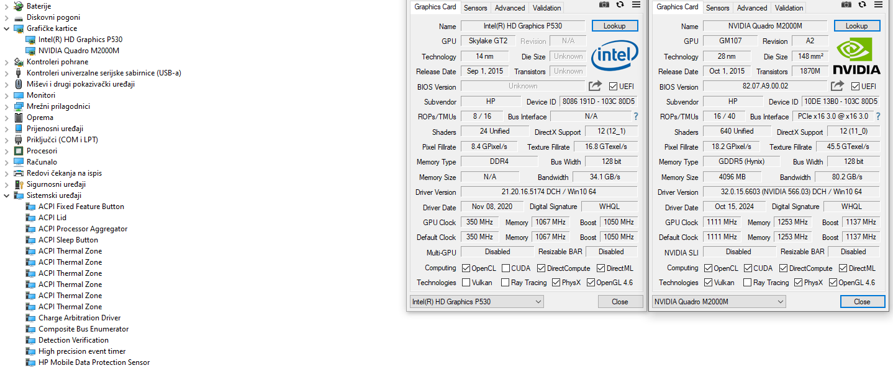

# BtPttZ
Bringing the P through the Z
## Bringing the Performance to the Zbook G3, HP brand, 15inch, and longer editions
##
## First step, adding the uefi bit to the quadro M2000M card
#### use the archive provided, with the modified nvflash executable to bypass the certification checksum, the batch file automates the flashing process with the modified rom included in the archive

##
## Tested, with rom boot options set to UEFI only, in the HP bios menu, and tested seperately, hybrid/auto graphics option and discrete graphics option only

